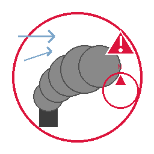

# 🌨️ NL-Alert Rookpluim Detector

[](https://github.com/hacs/integration)
[](https://github.com/phoenix-blue/nl-alert-monitor/releases)
[](LICENSE)


Een geavanceerde Home Assistant integratie voor het detecteren van gevaarlijke rookpluimen via het officiële **[NL-Alert systeem van de Nederlandse Overheid](https://www.nederlandwereldwijd.nl/themas/crisis-en-calamiteiten/nl-alert)**. 

<p align="center">
  
</p>

## 🔗 Officiële Databron

Deze integratie gebruikt officiële data van:
**[NL-Alert API - Nederlandse Overheid](https://www.nederlandwereldwijd.nl/themas/crisis-en-calamiteiten/nl-alert)**

*NL-Alert is het officiële waarschuwingssysteem van de Nederlandse overheid voor noodsituaties.*

## ✨ Functies

- **🚨 Real-time NL-Alert Monitoring**: Live updates van Nederlandse overheidsalerts  
- **🌨️ Intelligente Rookpluim Detectie**: Proprietary atmospheric dispersion modeling voor chemische incidenten
- **📍 GPS-gebaseerde Risico Analyse**: Automatische berekening of uw woning in de gevarenzone ligt
- **🌪️ Weersintegratie**: Real-time wind data voor accurate pluim voorspellingen  
- **🧭 Compass Visualisatie**: Visuele weergave van windrichting en rookpluim spreiding
- **🏠 Slimme Filtering**: Alleen relevante chemische/brand gerelateerde alerts
- **🧪 Test & Reset Services**: Test de integratie met simulatie alerts en reset functionaliteit
- **📊 Uitgebreide Dashboard Kaarten**: Ready-to-use Lovelace kaarten
- **🔄 Automatische Blueprints**: Pre-geconfigureerde automations

## 📦 Installatie

### Via HACS (Aanbevolen)

1. Open HACS in Home Assistant
2. Ga naar "Integrations" 
3. Klik op de drie puntjes (⋮) rechtsboven
4. Selecteer "Custom repositories"
5. Voeg toe:
   - **URL**: `https://github.com/phoenix-blue/nl-alert-monitor`
   - **Type**: Integration
6. Klik "ADD"
7. Zoek naar "NL-Alert Rookpluim Detector"
8. Klik "INSTALL"
9. Herstart Home Assistant

### Handmatige Installatie

1. Download de `custom_components/nl_alert` folder
2. Plaats deze in je `config/custom_components/` directory
3. Herstart Home Assistant
4. Ga naar Settings → Devices & Services
5. Klik "+ ADD INTEGRATION"
6. Zoek naar "NL-Alert"

## ⚙️ Configuratie

### Basis Setup

1. **Voeg integratie toe**:
   - Ga naar Settings → Devices & Services
   - Klik "+ ADD INTEGRATION" 
   - Zoek "NL-Alert Rookpluim Detector"

2. **Configureer locatie**:
   - Voer uw huisadres in of GPS coördinaten
   - Selecteer een weather entiteit voor wind data
   - Stel update interval in (aanbevolen: 5 minuten)

3. **Test de setup**:
   - Gebruik Developer Tools → Services
   - Test `nl_alert.test_alert` service
   - Reset met `nl_alert.reset_alerts` service

## 🏠 Entities

Na installatie zijn de volgende entities beschikbaar:

### Sensoren
| Entity | Beschrijving | Icon |
|--------|--------------|------|
| `sensor.nl_alert_status` | 🚨 Hoofdstatus van NL-Alert systeem |
| `sensor.nl_alert_active_alerts` | ⚠️ Aantal actieve alerts |  
| `sensor.nl_alert_historical_alerts` | 📋 Historische alerts (30 dagen) |
| `sensor.nl_alert_danger_compass` | 🧭 Compass met risico informatie |

### Services (Test & Beheer)
| Service | Beschrijving | Gebruik |
|---------|--------------|---------|
| `nl_alert.test_alert` | 🧪 Test simulatie activeren | Developer Tools → Services |
| `nl_alert.reset_alerts` | 🔄 Reset alle meldingen | Dashboard buttons of automations |

## 🎨 Dashboard Kaarten

### Basis Status Kaart

```yaml
type: entities
title: "🌨️ NL-Alert Rookpluim Status"
entities:
  - entity: sensor.nl_alert_status
    name: "Status"
  - entity: sensor.nl_alert_active_alerts  
    name: "Actieve Alerts"
  - entity: sensor.nl_alert_danger_compass
    name: "Risico Percentage"
```

### Test & Beheer Services

```yaml
type: horizontal-stack
cards:
  - type: button
    name: "🧪 Test Alert"
    icon: mdi:flask
    tap_action:
      action: call-service
      service: nl_alert.test_alert
  - type: button
    name: "🔄 Reset Alerts"
    icon: mdi:restart
    tap_action:
      action: call-service
      service: nl_alert.reset_alerts
```

## 🤖 Automations

### Automatische Ventilatie Controle

```yaml
alias: "NL-Alert: Sluit ventilatie bij chemisch gevaar"
description: "Sluit automatisch ventilatie bij detectie van gevaarlijke rookpluim"
trigger:
  - platform: numeric_state
    entity_id: sensor.nl_alert_danger_compass
    above: 5  # 5% risico threshold
condition:
  - condition: state
    entity_id: sensor.nl_alert_status
    state: "danger_detected"
action:
  - service: cover.close_cover
    target:
      entity_id: 
        - cover.ventilatie_woonkamer
        - cover.ventilatie_slaapkamer
  - service: notify.mobile_app_your_phone
    data:
      title: "⚠️ NL-Alert Rookpluim Gevaar"
      message: >
        Chemische rookpluim gedetecteerd! 
        Risico: {{ states('sensor.nl_alert_danger_compass') }}%
        Ventilatie automatisch gesloten.
```

## 📚 Documentatie

- **[Dashboard Cards](docs/DASHBOARD_CARDS.md)** - Uitgebreide Lovelace kaarten en visualisaties
- **[Automatisering Blueprints](docs/AUTOMATISERING_BLUEPRINT.md)** - Ready-to-use automations
- **[Troubleshooting Guide](docs/TROUBLESHOOTING_COMPLETE.md)** - Probleemoplossing en debugging

## 🤝 Bijdragen

Bijdragen zijn welkom! Zie [CONTRIBUTING.md](CONTRIBUTING.md) voor details over:
- Code style guidelines  
- Pull request process
- Issue reporting

## 🔒 Privacy & Security

- **Geen persoonlijke data** wordt verzonden naar externe servers
- **Alleen publieke NL-Alert data** wordt gebruikt  
- **Lokale berekeningen** voor alle risk assessments
- **Open source** - controleer de code zelf

## 📄 Licentie

Dit project is gelicenseerd onder de MIT License - zie [LICENSE](LICENSE) voor details.

## 🙏 Credits

- **Nederlandse Overheid** - voor het NL-Alert systeem
- **Home Assistant Community** - voor feedback en testing
- **NOAA/EPA** - voor atmospheric dispersion formulas

---

**⚠️ Disclaimer**: Deze integratie is een aanvulling op, geen vervanging voor officiële NL-Alert notificaties. Volg altijd officiële instructies van hulpdiensten bij noodsituaties.